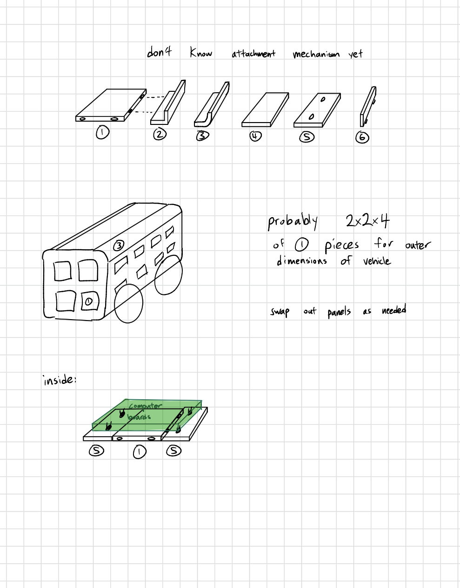
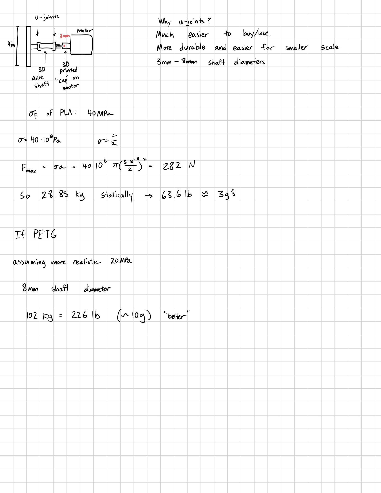
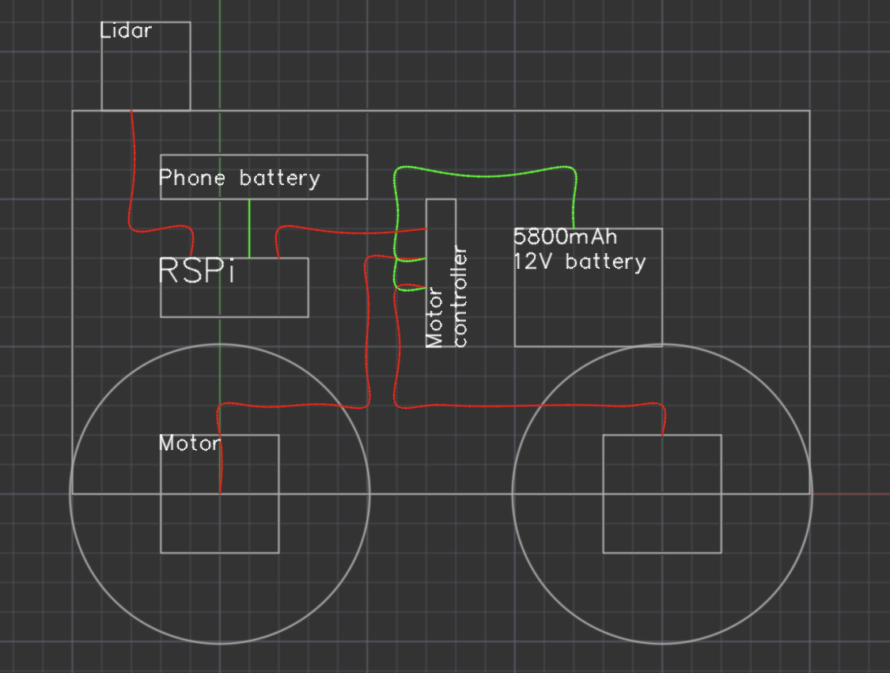
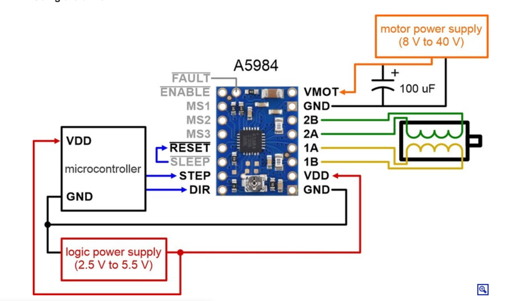

# Four-wheel ROS 2 LiDAR robot

ROS 2 Jazzy software for a Raspberry Pi 5, four STEP/DIR stepper drivers, an
MPU6050 IMU, and the Waveshare D500 kit (LDROBOT LD19 2D LiDAR). The package
supports physical hardware, keyboard driving, SLAM mapping, saved-map Nav2
navigation, and Gazebo Harmonic simulation.

1. [General project goal](#general-project-goal)
2. [File structure](#file-structure)
3. [Hardware list](#hardware-list)
4. [Project images](#project-images)
5. [Project features and decisions](#project-features-and-decisions)
6. [Issues and how we solved them](#issues-and-how-we-solved-them)
7. [Install](#install)
8. [Physical hardware setup and tests](#physical-hardware-setup-and-tests)
9. [Simulation](#simulation)
10. [Worklog](#worklog)

## General project goal

Build a small indoor/outdoor autonomous robot that can map a space, localize
in that map, and drive itself to a goal. The original product idea was a
cute food-delivery platform; later notes also listed outdoor jobs such as
trash collection, weed cutting, and GPS-guided travel. Those outdoor jobs
need extra sensors and tougher hardware, so this repository first proves the
core stack indoors:

- four-wheel skid-steer motion
- 2D LiDAR mapping with SLAM Toolbox
- saved-map navigation with Nav2
- optional IMU fusion for better short-term yaw
- a Gazebo simulation of the same ROS interfaces

The mechanical design is inspired by [TurtleBot3](https://www.turtlebot.com/turtlebot3/):
a simple mobile base, sensors on top, and replaceable skins rather than a
fixed enclosure. Early ideas included modular snap-fit tiles and
replaceable interior/exterior walls. The built robot uses a skateboard-style
3030 aluminum frame with 3D-printed motor mounts instead.

## File structure

```text
lidar-robot/
├── README.md
├── docs/
│   ├── cad/full-robot-assembly.stp  Fusion/STEP model of the built robot
│   └── images/                  Project photos and wiring figures
└── my_robot/                    ROS 2 Python package
    ├── package.xml              Package name, license, and dependencies
    ├── setup.py                 Installs nodes, launch, config, URDF, worlds
    ├── setup.cfg
    ├── resource/my_robot        ament package marker
    ├── config/
    │   ├── motors.yaml          GPIO pins and pulse-calibration numbers
    │   ├── mpu6050.yaml         I2C IMU driver settings
    │   ├── ekf.yaml             robot_localization fusion of wheels + IMU
    │   ├── slam.yaml            SLAM Toolbox mapping settings
    │   ├── nav2.yaml            AMCL, planners, costmaps, smoother
    │   └── gazebo_bridge.yaml   Gazebo ↔ ROS topic bridge
    ├── launch/
    │   ├── base.launch.py       Physical motors, LiDAR, optional IMU/EKF
    │   ├── mapping.launch.py    Physical base + SLAM Toolbox
    │   ├── navigation.launch.py Physical base + AMCL + Nav2
    │   ├── navigation_core.launch.py  Shared Nav2 servers
    │   ├── simulation.launch.py Gazebo robot, bridge, optional RViz
    │   ├── simulation_mapping.launch.py
    │   └── simulation_navigation.launch.py
    ├── my_robot/
    │   ├── base_controller.py   /cmd_vel → STEP rates + open-loop odom
    │   ├── stepper_hardware.py  Four GPIO pulse threads
    │   ├── mpu6050_driver.py    I2C IMU → /imu/data
    │   ├── lidar_reader.py      /scan connection diagnostics
    │   ├── manual_drive.py      Bounded front/back/left/right tests
    │   └── cmd_vel_watchdog.py  Simulation-only stale-command stop
    ├── urdf/robot.urdf          ROS frames and visual sizes
    ├── worlds/test_room.sdf     Gazebo room, robot, LiDAR, IMU
    ├── rviz/robot.rviz          Shared RViz layout
    └── test/                    Lint and mocked GPIO timing tests
```

How the main files work together:

- `base_controller.py` converts `/cmd_vel` (`linear.x`, `angular.z`) into left
  and right step rates, ramps those rates, stops if commands go stale, and
  publishes open-loop `/wheel/odom`.
- `stepper_hardware.py` owns the four STEP/DIR/RESET/SLEEP pins.
- `mpu6050_driver.py` publishes accelerometer and gyro data on `/imu/data`.
- `lidar_reader.py` reports closest-range and stale-scan warnings.
- `manual_drive.py` is the `ros2 run my_robot drive ...` test helper.
- `base.launch.py` starts the physical robot. Mapping and navigation launches
  include it, then add SLAM Toolbox or AMCL + Nav2.
- `navigation_core.launch.py` starts the shared Nav2 servers and remaps
  Jazzy's `/cmd_vel_smoothed` to `/cmd_vel`.
- Simulation launches use Gazebo instead of GPIO. They still speak
  `/cmd_vel`, `/odom`, `/scan`, `/imu/data`, and TF.

## Hardware list

CAD model: [docs/cad/full-robot-assembly.stp](docs/cad/full-robot-assembly.stp)
(Fusion 360 STEP export of the full robot assembly; open in Fusion 360, FreeCAD, or another STEP viewer.)

| Item | What we used | Notes |
| --- | --- | --- |
| Computer | Raspberry Pi 5 | Ubuntu 24.04 + ROS 2 Jazzy. An active fan was added after heat issues. |
| LiDAR | Waveshare D500 kit (LDROBOT LD19) | USB serial. Wiki: [D500 LiDAR Kit](https://www.waveshare.com/wiki/D500_LiDAR_Kit). |
| IMU | MPU6050 | I2C, default address `0x68` when AD0 is low. |
| Motors | 4 bipolar steppers, 1.8° / 200 steps per revolution | Early pick: [Olimex SM-42HB34F08AB](https://www.digikey.com/en/products/detail/olimex-ltd/SM-42HB34F08AB/21662229), 12 V, 1.33 A. Direct drive, no gearbox. |
| Drivers | 4 A4988 / A5984-style STEP/DIR boards | Current limit set near 1 A (`Vref` about 0.8 V on the boards we used). MS pins left unconnected, so the drivers stay in full-step mode. |
| Motor power | 12 V rechargeable pack, about 5.8 Ah | Sized for roughly an hour of four-motor current with margin. A 1 A wall supply was not enough for all four motors. |
| Pi power | Separate USB power bank / phone battery | Do not power motors from the Pi 5 V or 3.3 V pins. |
| Wheels | 4 in / about 10 cm diameter | Loaded radius in the URDF is 0.049 m. |
| Frame | 3030 aluminum extrusion | Replaced a planned one-piece carbon-fiber print. |
| Mounts | 3D-printed motor mounts and axle parts | Early notes used U-joints between 3 mm motor shafts and larger wheel shafts. |
| Caps | 100 µF electrolytic across each driver `VMOT`/`GND` | Limits supply spikes when stepping. |

Motor wiring color convention used during bring-up:

- `1A` black, `1B` green, `2A` red, `2B` blue

Split electrical system from the side-layout drawing: the phone battery feeds
the Pi, the 12 V pack feeds the motor drivers, and both grounds meet at the
drivers.

Default GPIO order is left-front, left-rear, right-front, right-rear (BCM
numbers, not physical header pins):

| Signal | LF | LR | RF | RR |
| --- | ---: | ---: | ---: | ---: |
| STEP | 14 | 23 | 17 | 5 |
| DIR | 15 | 24 | 27 | 6 |
| RESET | 4 | 25 | 22 | 26 |
| SLEEP | 12 | 7 | 16 | 1 |

`direction_inverted`: `[true, true, false, false]`

Change these in `my_robot/config/motors.yaml` if the physical wiring changes.

## Project images

These figures come from the project notebook. Photos of the assembled robot
are not in this repository yet.

Early modular-tile chassis sketch. This layout was later dropped for a
single skateboard-style frame.



Motor, 4 in wheel, and U-joint notes, including shaft-strength estimates.



First 2D side-view layout. Red is signal, green is power. The LiDAR sits at
the front, the Pi and its battery in the middle, and the 12 V pack at the
rear.



A5984-style driver wiring used as the electrical reference: STEP/DIR from the
Pi, 100 µF on motor power, and a shared logic ground.



## Project features and decisions

### Features that are in the repo

- Keyboard and bounded command-line driving (`front`, `back`, `left`, `right`)
- Open-loop wheel odometry from commanded stepper pulses
- D500 LiDAR scans on `/scan`
- Optional MPU6050 + EKF fusion
- Online SLAM mapping and map saving
- Saved-map Nav2 navigation
- Gazebo Harmonic simulation with the same high-level topics
- Collision-aware local planning with DWB; conservative speed limits for the Pi

### Mechanical decisions

- Four wheels instead of two, to keep the platform simple and stable. Notes
  assumed about 9 kg, 0.5 m/s, and 0.5 m/s² while sizing torque.
- Snap-fit 3 in tiles were dropped. 3D-printed latches were expected to creak,
  fit poorly, and be weak because printed plastic is not isotropic. Injection
  molding would have made that idea more realistic.
- A skateboard layout won: one strong flat frame, electronics on top, and a
  non-structural skin later.
- A single Markforged carbon-fiber frame was dropped after the print was
  estimated at more than 19 hours. 3030 extrusion plus printed motor mounts
  is easier to assemble and modify.
- Suspension was designed as a later add-on, not a first-version requirement.
- Camera support was planned and is not implemented yet.

### Electrical and software decisions

- Drive the steppers from the Pi GPIO with STEP/DIR pulses, not from an
  Arduino motor shield. One pulse is one full step (1.8°). Speed is the
  pulse frequency, not a PWM duty cycle.
- Leave driver MS pins unconnected. The A4988/A5984 internal pull-downs keep
  the chips in full-step mode, so the electrical step count is locked at 200
  pulses per motor revolution.
- Calibrate motion with `left_steps_per_meter`, `right_steps_per_meter`,
  `left_turn_steps_per_radian`, and `right_turn_steps_per_radian` instead of
  hiding error inside `wheel_radius` / `wheel_separation`.
- Use separate left and right turn coefficients because skid-steer left and
  right turns were not equal on the real floor.
- Keep IMU fusion optional. The MPU6050 has no magnetometer, so it helps
  short-term yaw rate and cannot provide absolute heading.
- Do not start Nav2 during mapping unless asked. The Pi was dropping scans
  and transforms when SLAM and Nav2 ran together.
- Build simulation around the same `/cmd_vel`, `/odom`, `/scan`, `/imu/data`,
  and TF contracts so mapping and Nav2 can be practiced without GPIO.

### Frames

- `base_footprint`: ground-level center used by Nav2 for planar collision
- `base_link`: chassis frame above the floor, normally at axle height
- `base_laser`: LiDAR scan origin; angle 0 is +X, forward
- `imu_link`: MPU6050 chip frame

ROS axes are +X forward, +Y left, and +Z up.

## Issues and how we solved them

| Problem | What we saw | Fix |
| --- | --- | --- |
| Wrong Ubuntu image | Pi stayed on a red light after a reflash | Ubuntu **24.04** is required for ROS 2 Jazzy binaries. Raspberry Pi OS is not a supported Jazzy platform. |
| Wall supply starved the motors | Four motors buzzed or refused to start together | Use the 12 V battery. A 1 A wall supply cannot feed four 1 A-class steppers. |
| Random wheels dead, stuck on, or buzzing | Motor 2 always on; motor 3 buzzed and did not turn | Rewired STEP/DIR/RESET/SLEEP, stopped RESET from being shorted, split shared jumper wires, and learned that RESET must stay high or STEP is ignored. |
| ENABLE vs RESET vs SLEEP confusion | Sleep seemed to work; RESET did not | RESET home-states the translator and ignores STEP until it is high. SLEEP cuts power and needs about 1 ms after wake before the next step. The code pulses RESET at start, holds it high, and uses SLEEP when a wheel is stopped. |
| GPIO pin conflicts | IMU needed I2C; some motor pins sit on UART/SPI | Moved motor pins to the table above. GPIO14/15 need the serial console off. GPIO7 is SPI CE1. GPIO1 is often reserved for HAT ID. |
| Vendor LiDAR package failed to build | Missing `pthread` in the given LDROBOT code | Build `ldlidar_stl_ros2` after ROS itself is installed, and keep the vendor package next to `my_robot` in `src`. |
| Printed parts did not fit | Assembly stopped | Measured the real robot, reprinted mounts, and put those sizes in the URDF. |
| Pi “battery” was not a battery | Logic power dropped | Separate USB power bank for the Pi; 12 V pack only for motors. |
| Distance math was wrong | 200 pulses turned the wheel once, but travel was about half the theoretical distance | Stopped treating `wheel_radius` as a software knob. Calibrate `steps_per_meter` from measured travel. Floor tests later landed near 707 / 699 steps/m. |
| Left and right turns disagreed | Left ~40° when 90° was requested; right needed a much larger coefficient | Separate `left_turn_steps_per_radian` and `right_turn_steps_per_radian`. Also check sagging hubs and drag before trusting the numbers. |
| Wheels sagged or fell off | Turns scrubbed; hubs walked off the shafts | Tape or glue hubs for tests; prefer moving arcs (`u`/`o`) over in-place `j`/`l` turns. |
| Motors stalled after raising speed | Buzz, missed steps, or no rotation | Raise `max_step_rate` and `max_step_acceleration` only after raised-wheel then floor tests. Current values are 500 steps/s and 300 steps/s²; older conservative limits were 75 and 100. |
| Pulse timing looked faster than commanded | 50 Hz controller woke every pulse thread even when the rate was unchanged | `set_rate()` now signals a thread only when the rate changes. A unit test covers that. |
| IMU did not start | `/imu/data` missing; mapping still fuzzy | Add the user to the `i2c` group, keep the robot still for gyro bias, and confirm `i2cdetect` shows `68`. One mapping run used a bad IMU init and only three wheels. |
| SLAM maps were fuzzy / scans dropped | Buffer warnings while printing debug | Turn `debug_logging` off while mapping. Do not start Nav2 during mapping unless needed. |
| Nav2 planned but the robot sat still | Controller rejected the path; wrong velocity topic | Jazzy smoother output is `/cmd_vel_smoothed`, not Humble's `/smoothed_cmd_vel`. `navigation_core.launch.py` remaps that to `/cmd_vel`. |
| Mapping plus Nav2 overloaded the Pi | Transform delays, `follow_path` timeouts | Mapping defaults to SLAM only. `bt_navigator` timeouts and AMCL transform tolerances were increased for the Pi. |
| Gazebo would not yaw | `/odom` said it turned; the body did not | SDF wheel friction was given a small lateral slip. That change is simulation-only. |
| Gazebo kept the last speed forever | Robot rolled after teleop stopped | `cmd_vel_watchdog.py` zeros velocity after 0.6 s. The physical controller already has a 0.5 s watchdog. |

Open limitations we did not fully remove:

- Odometry counts pulses sent to the drivers. It cannot see skipped steps or
  slip.
- Python on Linux is not hard real-time GPIO. Faster, cleaner motion would
  need a microcontroller generating STEP pulses.
- Outdoor GPS, camera, and suspension are still future work.
- Dependable navigation still wants wheel encoders.

## Install

Use 64-bit Ubuntu 24.04 and ROS 2 Jazzy.

Labels used below:

- **Once per machine**: run after a new OS install.
- **Pi only**: skip on a desktop that will only run Gazebo.
- **Desktop only**: skip on the Raspberry Pi.
- **Every new terminal**: ROS does not keep `source` across terminals.
- **After code changes**: launch, config, URDF, or Python edits.

### 1. ROS packages — once per machine

```bash
sudo apt update
sudo apt install -y ros-jazzy-desktop ros-jazzy-navigation2 \
  ros-jazzy-nav2-bringup ros-jazzy-slam-toolbox \
  ros-jazzy-robot-localization ros-jazzy-teleop-twist-keyboard \
  python3-rosdep
```

### 2. Raspberry Pi hardware packages — Pi only, once

```bash
sudo apt install -y python3-gpiozero python3-lgpio python3-smbus2 i2c-tools
```

### 3. Gazebo packages — desktop only, once

```bash
sudo apt install -y ros-jazzy-ros-gz
```

### 4. rosdep — once per machine

If it says rosdep is already initialized, continue with `rosdep update`.

```bash
sudo rosdep init
rosdep update
```

### 5. Workspace and source — once per machine

```bash
mkdir -p ~/ros2_ws/src
cd ~/ros2_ws/src
git clone https://github.com/gracexu24/lidar-robot.git
git clone https://github.com/ldrobotSensorTeam/ldlidar_stl_ros2.git
```

Later updates on the Pi are `git pull` inside this repo, then rebuild.

### 6. Dependencies and first build — once, then after new dependencies

```bash
cd ~/ros2_ws
source /opt/ros/jazzy/setup.bash
rosdep install --from-paths src --ignore-src -r -y
colcon build --symlink-install
source ~/ros2_ws/install/setup.bash
```

`source /opt/ros/jazzy/setup.bash` must run before `rosdep install` and
`colcon build`. The vendor LiDAR package expects ROS to already be installed.

### 7. Every new terminal

```bash
source /opt/ros/jazzy/setup.bash
source ~/ros2_ws/install/setup.bash
```

Confirm the package is visible:

```bash
ros2 pkg prefix my_robot
```

### 8. After changing package files

```bash
cd ~/ros2_ws
source /opt/ros/jazzy/setup.bash
colcon build --symlink-install --packages-select my_robot
source ~/ros2_ws/install/setup.bash
```

### 9. Package tests — optional, after code changes

```bash
cd ~/ros2_ws
source /opt/ros/jazzy/setup.bash
colcon test --packages-select my_robot
colcon test-result --verbose
```

The tests include lint checks and mocked motor sleep/reset/timing checks.
They do not move hardware.

### 10. One-time Pi permissions

Serial (LiDAR). Log out or reboot after the group change:

```bash
sudo usermod -aG dialout "$USER"
groups
```

I2C (IMU):

```bash
sudo usermod -aG i2c "$USER"
```

Enable I2C in `/boot/firmware/config.txt` if `/dev/i2c-1` is missing
(`dtparam=i2c_arm=on`), then reboot.

## Physical hardware setup and tests

Save work before unplugging the Pi. Unplug motor power before moving wires.

The Raspberry Pi GPIO pins must connect to stepper-driver logic inputs, not
directly to motors. Use one correctly sized driver per motor, an external
motor power supply, current limiting, and a common ground between the
supply, drivers, and Pi. Never power motors from a Pi 5 V or 3.3 V pin.

Raise the wheels for initial tests and keep a physical emergency motor-power
disconnect within reach.

GPIO7 is SPI CE1 and is unavailable while SPI is enabled. Either choose
another GPIO and move that SLEEP wire, or disable SPI in
`/boot/firmware/config.txt` if no other device uses it. GPIO14 and GPIO15
are UART pins, so the serial console must not use them.

The code assumes active-low RESET and SLEEP, as used by A4988-style drivers.
It pulses RESET during initialization, leaves RESET high, and pulls SLEEP
low when a wheel is stopped. Verify these levels against the exact driver
datasheet.

Driver current limit used on this robot: about 1 A, `Vref` about 0.8 V.
Set that on each board before long runs. See
[this current-limit walkthrough](https://youtu.be/89BHS9hfSUk?si=mE6hSFoFv12Aey9d)
if the pot location is unclear.

### Shared ROS commands

These commands are used by both the physical robot and simulation.

#### Keyboard control

A robot or simulation launch must already be running. In a separate sourced
terminal:

```bash
ros2 run teleop_twist_keyboard teleop_twist_keyboard \
  --ros-args --remap cmd_vel:=/cmd_vel
```

Useful keys:

- `i`: forward
- `,`: reverse
- `j`: turn left
- `l`: turn right
- `u` and `o`: move forward in left and right arcs
- `k`: stop
- `q` and `z`: increase and decrease all speeds
- `w` and `x`: increase and decrease linear speed
- `e` and `c`: increase and decrease angular speed
- `Ctrl+C`: exit

Prefer moving arcs instead of stationary turns when possible. Keyboard `u`
and `o` combine forward motion with turning, reducing tire scrub and stress
on the wheel hubs.

The physical motor controller has a 0.5-second watchdog, so hold or repeat a
movement key. Press `k` before leaving the keyboard terminal.

#### RViz setup

Simulation launches already start RViz with `rviz/robot.rviz`. That config
uses Fixed Frame `map` and adds the saved map, costmaps, laser scan, robot
model, TF, and the Navigation 2 panel.

Start RViz manually when a launch does not start it:

```bash
rviz2 -d "$(ros2 pkg prefix my_robot)/share/my_robot/rviz/robot.rviz"
```

For basic driving without SLAM or Nav2, use `odom` as the Fixed Frame. For
mapping and navigation, keep `map`. If a Map display shows nothing, set its
topic durability to Transient Local; `/map` is published once, not
continuously.

When using SSH, run RViz on another ROS 2 Jazzy computer on the same ROS
domain, use X11 forwarding, or use Foxglove.

#### Save the active map

Keep the mapping launch running. In another sourced terminal, choose a
filename without an extension and run:

```bash
MAP_NAME=${MAP_NAME:-$HOME/maps/home}
mkdir -p "$(dirname "$MAP_NAME")"
ros2 run nav2_map_server map_saver_cli -f "$MAP_NAME"
ls -l "$MAP_NAME.yaml" "$MAP_NAME.pgm"
```

Both the YAML and image file must exist before stopping mapping. Change
`MAP_NAME` to `$HOME/maps/sim_home` when saving a simulation map.

### Configure LiDAR serial access

Connect the D500 USB adapter and find its stable path:

```bash
ls -l /dev/serial/by-id/
```

Use the `/dev/serial/by-id/...` path in launch commands. `/dev/ttyUSB0` is
used below for brevity. Do not use broad `chmod 666` or `chmod 777`
permissions as a permanent solution.

### Motor connection test

Raise all wheels and start only the physical motor controller:

```bash
ros2 launch my_robot base.launch.py \
  start_motors:=true start_lidar:=false use_imu:=false \
  debug_logging:=true
```

In another sourced terminal, issue one bounded command at a time:

```bash
ros2 run my_robot drive front --duration 1 --speed 0.05
ros2 run my_robot drive back --duration 1 --speed 0.05
ros2 run my_robot drive left --duration 1 --turn-speed 0.4
ros2 run my_robot drive right --duration 1 --turn-speed 0.4
```

The debug output reports GPIO initialization, target and actual pulse rates,
pulse counts, wake/sleep changes, and watchdog stops. Pulse counts prove
that software generated pulses; without encoders they do not prove that a
motor physically moved.

### Keyboard-only motor movement

Raise-test all wheels first. Terminal 1 starts the motor controller without
the LiDAR or IMU:

```bash
ros2 launch my_robot base.launch.py \
  start_motors:=true start_lidar:=false use_imu:=false \
  debug_logging:=true
```

In Terminal 2, run the command under **Keyboard control**.

### IMU connection test

The I2C scan must show address `68`, or `69` when AD0 is tied high:

```bash
ls -l /dev/i2c-1
i2cdetect -y 1
```

Keep the robot still and start only the MPU6050 node:

```bash
ros2 run my_robot mpu6050_driver --ros-args \
  --params-file "$(ros2 pkg prefix my_robot)/share/my_robot/config/mpu6050.yaml" \
  -p debug_logging:=true
```

In another sourced terminal:

```bash
timeout 5s ros2 topic hz /imu/data
ros2 topic echo /imu/data --once
```

The data rate should be near 50 Hz. At rest, angular velocity should be near
zero and total acceleration near 9.8 m/s². Keep the robot still for the
first approximately 2.5 seconds while gyro bias is measured.

### LiDAR connection test

Start only the LiDAR:

```bash
ros2 launch my_robot base.launch.py \
  start_motors:=false start_lidar:=true use_imu:=false \
  lidar_port:=/dev/ttyUSB0 debug_logging:=true
```

In another sourced terminal:

```bash
ros2 topic info /scan --verbose
timeout 5s ros2 topic hz /scan
ros2 topic echo /scan --once
```

The expected rate is about 10 Hz. A few `nan` values are normal when no
valid reflection is returned. Debug output reports the closest valid
distance and warns when the scan stream is missing or stale.

In RViz, set Fixed Frame to `base_laser`, add `/scan` as a LaserScan, and
move an object in front of the sensor.

### Values to measure and tune

Use metres, radians, seconds, kilograms, and SI-derived units throughout the
configuration. Define `base_link` at the robot's rotation center: halfway
between the front and rear axles, on the left-to-right centerline, at axle
height. `base_footprint` is the point directly below it on the floor.

Record these physical measurements before calibration:

- loaded wheel radius: axle center to floor with the robot at operating weight
- left-to-right wheel separation: center of left tread to center of right tread
- wheelbase: front axle center to rear axle center
- overall body length, width, and height, including parts that can collide
- front, rear, left, and right extents measured from `base_link`
- floor-to-axle height
- robot total mass and approximate center of mass, if Gazebo should be realistic
- LiDAR sensing-center position and orientation relative to `base_link`
- IMU chip-center position and board orientation relative to `base_link`

Enter or tune the following values.

#### `my_robot/config/motors.yaml`

- `step_pins`, `dir_pins`, `reset_pins`, `sleep_pins`: actual BCM GPIO wiring
  in LF, LR, RF, RR order
- `direction_inverted`: one Boolean per wheel; tune with the wheels raised
- `left_steps_per_meter`: calibrated average left-side pulses per metre
- `right_steps_per_meter`: calibrated average right-side pulses per metre
- `left_turn_steps_per_radian`: average pulses for one radian of left rotation
- `right_turn_steps_per_radian`: average pulses for one radian of right rotation
- `max_step_rate`: highest reliable pulse rate in steps/s without missed steps
- `max_step_acceleration`: highest reliable ramp in steps/s² without stalling
- `command_timeout`: safety stop delay in seconds; normally leave at 0.5

The current controller sends one rate to both left wheels and another to both
right wheels. Physical wheel radius and separation remain real dimensions in
the URDF and Gazebo model; motor conversion uses the directly measured pulse
coefficients above.

#### `my_robot/urdf/robot.urdf`

- body box `size`: measured length, width, and height in metres
- body visual `origin xyz`: body-box center relative to `base_link`
- `base_joint` Z: floor-to-`base_link` height, normally the loaded wheel radius
- `laser_joint xyz`: `base_link` to the LiDAR rotating/sensing center in metres
- `laser_joint rpy`: LiDAR roll, pitch, and yaw in radians
- `imu_joint xyz`: `base_link` to the center of the MPU6050 chip in metres
- `imu_joint rpy`: rotation needed to align IMU axes with the ROS robot axes

Common angles are 90° = 1.5708 rad and 180° = 3.1416 rad. Sensor positions
must be measured to the sensing center, not to an enclosure edge.

#### `my_robot/config/mpu6050.yaml`

- `i2c_bus`: bus reported by the system, normally `1`
- `i2c_address`: `0x68` or `0x69`, as reported by `i2cdetect`
- `gyro_stddev`: stationary angular-velocity standard deviation in rad/s
- `accel_stddev`: stationary linear-acceleration standard deviation in m/s²
- `publish_rate`: measured sustainable data rate; normally leave at 50 Hz
- `calibration_samples`: increase for a steadier bias estimate if startup time
  is acceptable; keep the robot still for all samples

The `frame_id` must remain the same as the URDF IMU link unless both are
renamed together.

#### `my_robot/config/nav2.yaml`

- robot collision shape in both local and global costmaps: use either
  `robot_radius` or a `footprint`, but not both
- `robot_radius`: center to the furthest collidable point plus a small margin
- rectangular `footprint`: ordered `[x, y]` corners measured from
  `base_footprint`, including wheels, bumpers, and sensor mounts
- `footprint_padding`: additional collision margin, typically 0.01–0.03 m
- `inflation_radius`: desired navigation clearance around obstacles
- `obstacle_max_range`: maximum range at which LiDAR returns are reliably marked
- `raytrace_max_range`: reliable clearing range, slightly greater than the
  obstacle range but not beyond useful LiDAR data
- `max_vel_x` and `max_vel_theta`: safe measured linear and angular speeds
- `acc_lim_x`, `decel_lim_x`, `acc_lim_theta`, `decel_lim_theta`: acceleration
  limits that do not cause skipped steps or tipping
- velocity-smoother limits: keep them consistent with the controller limits
- goal tolerances and progress timeout: tune only after odometry is calibrated

For a centered rectangular robot, the minimum enclosing radius is:

```text
robot_radius = sqrt((length / 2)² + (width / 2)²) + safety margin
```

A more accurate asymmetric footprint uses the measured extents:

```yaml
footprint: "[[front, left], [front, -right], [-rear, -right], [-rear, left]]"
footprint_padding: 0.02
```

Replace `front`, `rear`, `left`, and `right` with distances in metres, and
use the same footprint in both costmaps.

#### `my_robot/config/slam.yaml`

- `max_laser_range`: maximum distance that produces dependable measurements,
  not merely the advertised maximum
- `resolution`: map cell size in metres; 0.05 m is a normal starting point
- minimum travel distance and heading: tune only if maps update too often or
  fail to update during deliberate motion

#### `my_robot/worlds/test_room.sdf`

These values affect only Gazebo. Copy calibrated real dimensions when the
simulation should match the physical robot:

- body collision and visual length, width, height, and center
- wheel X/Y positions, radius, width, mass, and inertia
- `wheel_separation` and `wheel_radius` in the DiffDrive plugin
- robot mass, center of mass, and inertia estimates
- simulated LiDAR and IMU poses
- LiDAR minimum/maximum range, sample count, and update rate

The URDF and SDF are separate models; changing one does not update the other.
The current SDF is synchronized to the measured 0.24 × 0.16 × 0.04 m body,
0.049 m wheel radius, 0.03 m wheel width, 0.165 m wheel separation, and
current LiDAR and IMU transforms. It still assumes a 0.22 m wheelbase, 8 kg
base mass, and 0.3 kg per wheel until those values are measured.

### Calibration procedure

1. Verify all GPIO assignments against the physical wiring.
2. Raise the wheels and tune `direction_inverted`.
3. Calculate initial steps/metre, then measure left and right travel.
4. Find conservative step-rate and acceleration limits.
5. Calibrate straight distance, then steps/radian for turns.
6. Enter body and sensor measurements in the URDF and Nav2 costmaps.
7. Validate IMU axes and noise values.
8. Copy the final geometry into the Gazebo SDF if simulation should match.

Calculate an initial translation estimate from the electrical and mechanical
configuration:

```text
steps_per_wheel_revolution =
    motor full steps/revolution × microstep setting × gearbox ratio

initial steps_per_meter =
    steps_per_wheel_revolution ÷ (2π × loaded wheel radius)
```

The A4988 MS1, MS2, and MS3 inputs have internal pull-down resistors. When
all three pins are unconnected, the driver uses full-step mode. Therefore a
1.8° motor requires 200 STEP pulses per motor revolution. With direct drive,
that is also 200 pulses per wheel revolution. A gearbox would multiply this
value by its reduction ratio.

Use this result as the initial value for both `left_steps_per_meter` and
`right_steps_per_meter`. The controller changes STEP frequency to change
speed:

```text
left frequency = requested translation × left_steps_per_meter
                 - requested rotation × direction_turn_steps_per_radian

right frequency = requested translation × right_steps_per_meter
                  + requested rotation × direction_turn_steps_per_radian
```

With a 0.049 m wheel radius and 200 steps/revolution, the theoretical
starting value is about 650 steps/m. Use the configured left and right
values when calculating the requested pulse rates.

#### Correct movement directions

Raise all wheels and run the short front, back, left, and right commands
from the motor test:

- `front`: all four wheel contact surfaces must move toward the robot's rear,
  which propels the robot forward when placed on the floor
- `back`: all four wheels must reverse
- `left`: left wheels reverse while right wheels move forward
- `right`: right wheels reverse while left wheels move forward

If one wheel is reversed, toggle only its matching `direction_inverted`
entry. If an entire side behaves incorrectly, verify LF/LR/RF/RR GPIO
ordering before changing calibration. Pulse calibration changes distance and
angle, not GPIO direction.

#### Calibrate forward and backward distance

Use a flat, high-traction surface at operating weight. Mark the start point
and run:

```bash
ros2 run my_robot drive front --duration 10 --speed 0.10
```

The expected distance is speed × duration, or 1.0 m for this command.
Measure from the same physical point before and after movement. Calibrate
each side from generated pulse counts and measured distance:

```text
steps_per_meter = generated side pulse count ÷ measured distance
```

For a simple whole-robot correction when individual pulse counts were not
recorded:

```text
new side steps_per_meter =
    old side steps_per_meter × expected distance ÷ measured distance
```

Repeat forward at least three times and use the average measured distance.
Then repeat backward. If forward and backward differ substantially, inspect
driver current limits, loose wheels, backlash, floor slip, battery voltage,
and missed steps; fixed coefficients cannot correct a direction-dependent
mechanical error.

If the robot consistently curves while all four directions are correct, do
not change turn calibration first. Correct left/right steps-per-metre values
only after checking unequal wheel diameters, binding, driver current, motor
skipping, weight distribution, and traction. There are side-specific
coefficients, but no individual-wheel coefficients or encoders.

Measured bring-up points from the notebook:

- 4 s at 0.25 m/s should travel 1.0 m
- first floor set: 1.13 m, 1.23 m, 1.18 m
- after raising `max_step_rate` and retuning: 0.93 m, 0.93 m, then a
  consistent straight line
- wheels were taped during some of those runs

#### Calibrate turns

After straight distance is accurate, mark the robot's initial heading and
request a slow 180° left turn:

```bash
ros2 run my_robot drive left --duration 15.708 --turn-speed 0.20
```

A quicker check used during bring-up was:

```bash
ros2 run my_robot drive left --duration 3.142 --turn-speed 0.5
```

That command requested about 90° and produced about 40° before the left
coefficient was increased.

Measure the actual angle. Apply the correction separately to
`left_turn_steps_per_radian` or `right_turn_steps_per_radian`:

```text
new direction_turn_steps_per_radian =
    old direction_turn_steps_per_radian × expected angle ÷ measured angle
```

It can also be calculated directly when pulse totals are available:

```text
direction_turn_steps_per_radian =
    average absolute side pulse count ÷ measured angle in radians
```

Repeat each direction several times and average its results. Calibrate on
the same floor used for navigation because four-wheel skid-steer turning
depends strongly on tire scrub and traction. If the directional values
differ greatly, correct mechanical drag, loose hubs, motor current, wheel
size, or weight balance; direction-specific calibration must not hide an
unstable fault.

#### Tune rate and acceleration

Begin at low speed with the wheels raised, then test on the floor at
operating weight. Reduce `max_step_rate` when motors buzz, stop rotating, or
lose steps at steady speed. Reduce `max_step_acceleration` when they lose
steps while starting, stopping, or reversing. Set conservative limits below
the first failure point, then repeat the straight and turn calibration
because missed steps invalidate those measurements.

### Map with the physical robot

Terminal 1 starts the robot and SLAM Toolbox. Nav2 is disabled during
manual mapping by default to reduce CPU load and transform delays:

```bash
ros2 launch my_robot mapping.launch.py \
  lidar_port:=/dev/ttyUSB0 use_imu:=false debug_logging:=false
```

Set `start_nav2:=true` only when Nav2 servers are specifically needed while
mapping.

Terminal 2 runs RViz using the shared RViz setup with Fixed Frame `map`.
Terminal 3 runs the shared keyboard-control command.

Drive slowly along boundaries, avoid rapid turns, and revisit the starting
area to create loop closures. Verify that walls remain sharp and aligned. In
Terminal 4, follow **Save the active map** while mapping remains running.

Add `use_imu:=true` only after the IMU test succeeds. The MPU6050 improves
short-term turn estimates but has no magnetometer and cannot eliminate
long-term yaw drift.

Notebook mapping runs:

- Map 1: usable but noisy; a wheel came off
- Map 2: IMU enabled and slower speeds; IMU had not initialized
- Map 3: different IMU rate and only three wheels; turns still smeared the map

### Navigate on a physical saved map

Stop mapping, then start saved-map navigation in Terminal 1:

```bash
ros2 launch my_robot navigation.launch.py \
  map:=$HOME/maps/home.yaml \
  lidar_port:=/dev/ttyUSB0 use_imu:=false debug_logging:=true
```

Terminal 2 runs RViz with Fixed Frame `map`. Use **2D Pose Estimate** to set
the robot's measured starting position and heading. Send a short
unobstructed **Nav2 Goal**, then increase the distance after verifying
localization, obstacle detection, stopping, and recovery behavior.

Nav2 can handle some moving obstacles, but this platform is not a safety
system. It should not be trusted around people or fragile objects without a
person ready to cut motor power.

## Simulation

Simulation and hardware use the same high-level ROS 2 interfaces:

- `/cmd_vel` carries movement commands
- `/odom` reports robot motion
- `/scan` provides LiDAR measurements
- `/imu/data` provides IMU measurements
- the TF tree describes the robot frames
- SLAM Toolbox, Nav2, and their configuration files are shared

The low-level implementations are different. On hardware, `base_controller.py`
creates STEP/DIR pulses, the LDROBOT driver publishes real scans, and
`mpu6050_driver.py` publishes real IMU data. In Gazebo, a DiffDrive plugin
replaces GPIO motors, simulated sensors replace the D500 and MPU6050, and
`cmd_vel_watchdog.py` stops the model about 0.6 s after `/cmd_vel` goes
stale.

Simulation therefore tests mapping, localization, navigation, transforms,
and topic connections. It does not test GPIO timing, wiring, driver
current, missed steps, tire scrub, USB LiDAR enumeration, or MPU6050 I2C.
Calibrate the physical drivetrain even when Gazebo looks correct.

### Files that exist only for Gazebo

- `worlds/test_room.sdf`: room, obstacles, four-wheel robot, GPU LiDAR, IMU.
  Wheel cylinders are rotated −90°, joint axes are in the model frame, and
  wheel friction has a small lateral slip so skid-steer can yaw.
- `config/gazebo_bridge.yaml`: clock, commands, odometry, TF, scans, IMU.
  Gazebo listens on `/cmd_vel_safe`.
- `my_robot/cmd_vel_watchdog.py` and `launch/simulation.launch.py`: stop
  Gazebo when `/cmd_vel` is stale.
- `launch/simulation_navigation.launch.py`: sets `set_initial_pose:=true`
  because the simulated robot always starts at the world origin.

Do not copy SDF wheel friction, Gazebo axis fixes, or the simulation
watchdog onto the Raspberry Pi.

### Shared changes that also apply on hardware

- `launch/navigation_core.launch.py` remaps `/cmd_vel_smoothed` to
  `/cmd_vel`. The old Humble name left Nav2 planning while the robot sat
  still.
- `config/nav2.yaml`: AMCL `transform_tolerance` 1.0 s, global costmap
  `initial_transform_timeout` 60 s, controller frequency 10 Hz, and a
  larger DWB transform tolerance.
- `launch/navigation.launch.py`: optional `set_initial_pose` (default
  `false` on hardware). On the Pi, still use **2D Pose Estimate**.
- `rviz/robot.rviz`: the same layout can visualize the physical robot.

`nav2.yaml` speed limits stay conservative (`max_vel_x` 0.10 m/s) for both
targets. Raise them only after the physical wheels are calibrated.

The robot is embedded in `worlds/test_room.sdf`; it is not spawned from the
URDF. `urdf/robot.urdf` still supplies the static ROS transform tree used by
RViz and Nav2.

### Bring-up

Use a desktop with Gazebo Harmonic. Source the workspace in every terminal.
Run only one Gazebo instance. After changing launch, config, URDF, SDF, or
RViz files, rebuild and source again.

Typical sequence:

1. Drive with `ros2 launch my_robot simulation.launch.py start_rviz:=true`
   and keyboard teleop. In this mode only, set RViz Fixed Frame to `odom`.
2. Map with `ros2 launch my_robot simulation_mapping.launch.py start_rviz:=true`,
   drive the walls slowly, then save `$HOME/maps/sim_home`.
3. Stop mapping. Navigate with
   `ros2 launch my_robot simulation_navigation.launch.py map:=$HOME/maps/sim_home.yaml start_rviz:=true`.
   Wait until the log says `Managed nodes are active`, then send a short
   Nav2 Goal.

### Basic simulation and keyboard movement

```bash
ros2 launch my_robot simulation.launch.py start_rviz:=true
```

In a second sourced terminal, run **Keyboard control**. In RViz, use Fixed
Frame `odom`.

Validate the simulated interfaces:

```bash
ros2 topic echo /clock --once
timeout 5s ros2 topic hz /scan
timeout 5s ros2 topic hz /odom
timeout 5s ros2 topic hz /imu/data
ros2 run tf2_ros tf2_echo odom base_footprint
```

Without a display:

```bash
ros2 launch my_robot simulation.launch.py headless:=true
```

### Create a map in simulation

Stop any existing Gazebo launch first.

```bash
ros2 launch my_robot simulation_mapping.launch.py start_rviz:=true
```

Drive the complete room and revisit the start. In RViz, use Fixed Frame
`map`. Save the map with:

```bash
export MAP_NAME=$HOME/maps/sim_home
```

then follow **Save the active map**. Stop mapping only after both
`sim_home.yaml` and `sim_home.pgm` exist.

### Navigate on a simulated saved map

```bash
ros2 launch my_robot simulation_navigation.launch.py \
  map:=$HOME/maps/sim_home.yaml start_rviz:=true
```

Simulation navigation seeds AMCL at the Gazebo origin. Confirm alignment;
use **2D Pose Estimate** only if the robot is offset. Then send a short
**Nav2 Goal**. Verify costmaps, `/cmd_vel`, stopping, and recovery.

If AMCL logs `Please set the initial pose` or Nav2 says `Action server is
inactive`, AMCL has not published `map` yet. Rebuild, source, and restart
the launch. On the physical robot, set **2D Pose Estimate** within about
one minute of launch.

### What was verified in simulation

- Straight forward and reverse motion, then in-place left and right turns
- Simulated `/scan`, `/odom`, `/imu/data`, and `/clock`
- SLAM Toolbox building `/map` while driving the test room
- AMCL localizing on a saved map after an origin pose is available
- Nav2 accepting a goal and sending velocity through the smoother into Gazebo

## Worklog

### 8 June

Preliminary design and a first outdoor-use discussion. Product ideas:
food delivery, trash collection, weed cutting, GPS-guided travel. Outdoor
work would need more than LiDAR and a tougher drivetrain.

### 19 June

Hardware purchased. Motor sizing used a 9 kg, 0.5 m/s, 0.5 m/s² estimate
and 2 in wheels, then moved toward larger 4 in wheels. Driver options
compared Adafruit/Pololu I2C boards against cheaper STEP/DIR boards with a
current pot.

### 20 June

Raspberry Pi setup: Ubuntu on the SD card, a Pi battery, and D500 LiDAR
research from the Waveshare wiki. Next software work was ROS, Git, and a
first `/scan` bring-up.

### 22 June

Soldered motor-controller boards, added 100 µF capacitors, set driver
current limits, checked the 12 V supply wattage, and wrote the first STEP
pulse scripts.

### 9 July

Added an active Pi fan. First pinout: GPIO 17 STEP, 27 DIR, 22 RESET, with
coil colors black/green/red/blue. Confirmed the drivers use STEP/DIR, not
PWM. A ten-step `gpiozero` script proved that RESET must be high before
pulses do anything.

### 12 July

Dropped the snap-fit tile frame because of print strength, latch fit, and
weight. Switched to a skateboard-style single frame with a cosmetic skin.
Suspension stayed low priority. Documented that one STEP pulse is 1.8°, and
the delay between pulses is speed.

### 24 July

Software plan: Gazebo first, then the repo, then electronics. Required
code: motor interface, odometry, URDF, configuration. Required tests:
LiDAR in ROS, wheels in ROS, shape calibration, SLAM, autonomous motion.
Workflow: SSH into the Pi from Cursor, push, pull on the Pi.

### 14 August

Body-on-frame with 3030 aluminum extrusion after the Markforged carbon
frame print was more than 19 hours. Bought 400 mm 3030 and sliding M5 nuts;
the extrusion was shorter than the first CAD, so the model had to change.
First 2D side-view layout drawn, with a note that the stack might be top
heavy.

### 18 August

Full wiring diagram. Current limit set to about 1 A / 0.8 V `Vref`. Local
Python venv used `gpiozero` for the first multi-motor scripts. Repo split
into LiDAR test, motor test, and mechanical fitting.

### 20 August

Multi-motor debug. Learned RESET, ENABLE, and SLEEP from the A5984 notes.
Issues: motor 2 stuck on, motor 1 buzzed after stop, motor 3 buzzed and did
not move, motor 4 worked only after rewiring. Fixes were wiring, RESET
shorts, and split jumpers. The 1 A wall supply could not run four motors;
the battery could. Recorded 200 pulses = 1 revolution and 10 cm wheel
diameter. First travel test: one wheel revolution did not travel the
expected distance. Direction bits that produced forward motion:

```text
Dir1 on, Dir2 off, Dir3 on, Dir4 off
```

### 24 August

Pi showed a red power light; a reflash failed until Ubuntu 24.04 was used.
Reconnected GitHub SSH. Started IMU work and had to move pins for I2C.
Vendor LiDAR code was missing `pthread`. GPIO map locked to the current
LF/LR/RF/RR table. Printed parts did not fit and needed a reprint. The Pi
power pack was not actually a battery.

### 27 August

Robot measurements taken. Test plan: update sizes, map with LiDAR, drive
manually, save a map, try autonomous. First motor trial: one wheel dead,
then two; assumed one driver had failed. LiDAR scan looked sparse. Notes
on `base_footprint` / `base_link` / `base_laser` written. Safety reminder:
save before unplugging, unplug power before moving wires.

### 29 August

Replacement motor driver worked. Right turns were worse than left. Wheels
sagged. First numeric calibration:

```bash
ros2 run my_robot drive front --duration 4 --speed 0.25
```

Measured 1.13 m, 1.23 m, and 1.18 m instead of 1.0 m. Wheels taped for
repeatability. Realized the code cannot change electrical microstepping
because the MS pins were never wired; speed has to come from step
frequency. Ubuntu remote-desktop access set up for the Pi.

### 31 August

Second calibration after raising max speed. The same 4 s / 0.25 m/s
command traveled 0.93 m twice and held a straight line. Left turn at
3.142 s / 0.5 rad/s produced about 40°. IMU vs no-IMU mapping compared.
Map 1 was acceptable until a wheel came off. Map 2 used IMU and slower
speeds, but the IMU had not initialized. Map 3 used a different IMU rate
and three wheels; turns still ruined the map. Nav2 planned a path but the
controller was subscribed to the wrong velocity topic. Debug printing was
starving the SLAM scan buffer. Batteries were running down during tests.

### 1 September

Floor tests replaced the theoretical 650 steps/m values with 707.0 and
698.9. Unequal in-place turns produced separate left/right radian
coefficients (170.0 and 482.4). Rate/acceleration limits were raised from
the original 75 / 100 comments to 500 / 300. IMU publish rate stayed at
50 Hz and the EKF at 20 Hz. Mapping no longer starts Nav2 by default.
Nav2's velocity smoother remap was corrected from `smoothed_cmd_vel` to
`cmd_vel_smoothed`, controller frequency set to 10 Hz, and `bt_navigator`
timeouts increased so the Pi can acknowledge `follow_path`. Node shutdown
now uses `rclpy.try_shutdown()` so Ctrl+C does not look like a crash.
`set_rate()` no longer wakes pulse threads when the rate is unchanged.
